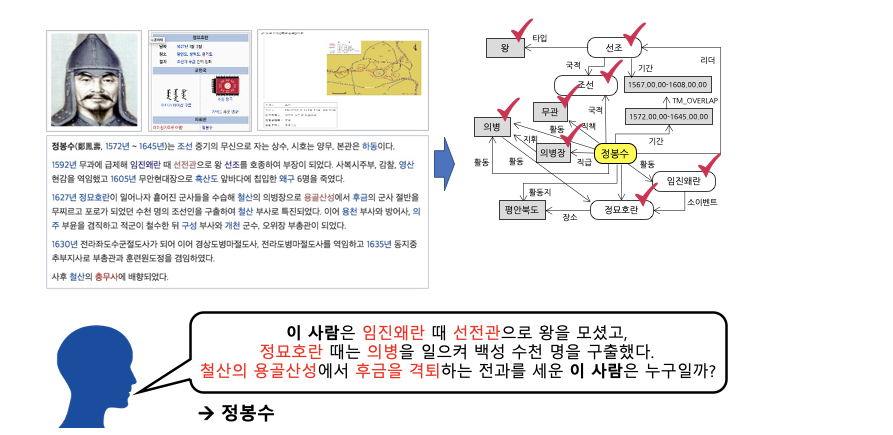
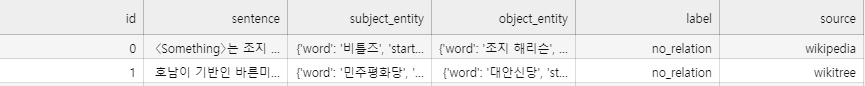
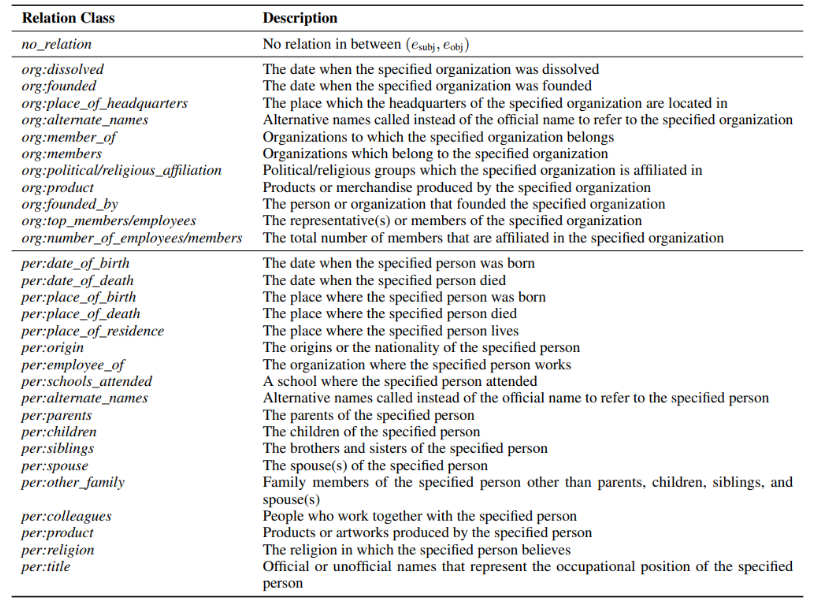

# [P-Stage] KLUE-Relation Extraction

KLUE 데이터 셋을 이용한 문장 내 단어(Entity)간 관계 추출  

Naver Boostcamp AI Tech 팀 프로젝트 입니다.

<br>

# Table of Content

- [Competition Overview](#competition-overview)
- [Data Definition](#data-definition)
- [Evaluation Method](#evaluation-method)
- [Usage](#usage)
- [Competition Result](#competition-result)
- [Archive Contents](#archive-contents)
- [Source Code](#source-code)

<br>

# Competition Overview


- 문장 속에서 단어간에 관계성을 파악하는 것은 의미나 의도를 해석함에 있어서 많은 도움을 줍니다.
- 그림의 예시와 같이 요약된 정보를 사용해 QA 시스템 구축과 활용이 가능하며, 이외에도 요약된 언어 정보를 바탕으로 효율적인 시스템 및 서비스 구성이 가능합니다.
- **관계 추출(Relation Extraction)** 은 문장의 단어(Entity)에 대한 속성과 관계를 예측하는 문제입니다. 관계 추출은 지식 그래프 구축을 위한 핵심 구성 요소로, 구조화된 검색, 감정 분석, 질문 답변하기, 요약과 같은 자연어처리 응용 프로그램에서 중요합니다. 비구조적인 자연어 문장에서 구조적인 triple을 추출해 정보를 요약하고, 중요한 성분을 핵심적으로 파악할 수 있습니다.
- 문장, 단어에 대한 정보를 통해 ,문장 속에서 단어 사이의 관계를 추론하는 모델을 학습시켜, 인공지능 모델이 단어들의 속성과 관계를 파악하며 개념을 학습할 수 있음을 프로젝트를 통해 보여줍니다.
- Competition Example
    ```
    sentence: 오라클(구 썬 마이크로시스템즈)에서 제공하는 자바 가상 머신 말고도 각 운영 체제 개발사가 제공하는 자바 가상 머신 및 오픈소스로 개발된 구형 버전의 온전한 자바 VM도 있으며, GNU의 GCJ나 아파치 소프트웨어 재단(ASF: Apache Software Foundation)의 하모니(Harmony)와 같은 아직은 완전하지 않지만 지속적인 오픈 소스 자바 가상 머신도 존재한다.
    subject_entity: 썬 마이크로시스템즈
    object_entity: 오라클

    relation: 단체:별칭 (org:alternate_names)
    ```
- License : CC-BY-2.0
- Link : https://klue-benchmark.com/

<br>

# Data Definition
- KLUE-RE dataset
    - https://klue-benchmark.com/tasks/70/overview/description
- 전체 데이터에 대한 통계
    - train dataset : 32470 rows
    - test dataset  : 7765 rows
- data structure

    - column 1: 샘플 순서 id
    - column 2: sentence.
    - column 3: subject_entity
    - column 4: object_entity
    - column 5: label
    - column 6: data source(출처)
- Input
    - sentence, subject_entity, object_entity
- Output
    - pred_label
        - relation 30개 중 하나를 예측한 결과
    - probs
        - 30개 클래스 각각에 대해 예측한 확률 
    - Relation Class


<br>

# Evaluation Method
- KLUE-RE evaluation metric 사용.(2개의 평가 기준)
    1. **Micro F1 Score**
        - no_relation class를 제외
    2. **AUPRC**(**A**rea **U**nder the **P**recision-**R**ecall **C**urve)
        - 모든 Class에 대하여 평가
- 2가지 metric으로 평가하되, Micro F1 score가 우선시 됩니다.
- Micro F1 Score
    - micro-precision과 micro-recall의 조화 평균
    - 각 샘플에 동일한 importance를 부여해, 샘플이 많은 클래스에 더 많은 가중치를 부여합니다.
    - 데이터 분포상 많은 부분을 차지하고 있는 no_relation class는 제외하고 F1 score가 계산
<br>

<br>

<br>

<br>

- AUPRC
    - x축은 Recall, y축은 Precision이며,  
      모든 class에 대한 평균적인 AUPRC로 계산해 score를 측정 합니다. imbalance한 데이터에 유용한 metric 입니다.

    - 위 그래프의 예시는 scikit-learn의 Precision-Recall 그래프의 예시 입니다. 그림의 예시와 같이 class 0, 1, 2의 area(면적 값)을 각각 구한 후, 평균을 계산한 결과를 AUPRC score로 사용합니다.
- Reference
    - https://towardsdatascience.com/handling-imbalanced-datasets-in-machine-learning-7a0e84220f28
    - https://scikit-learn.org/stable/auto_examples/model_selection/plot_precision_recall.html#sphx-glr-auto-examples-model-selection-plot-precision-recall-py

# Competition Result
- Public LB
    - Micro F1 Score : 
    - AUPRC : 

<br>

# Usage

>**Install Requirements**
```bash
# pip install -r requirements.txt
```

>**train Configuration**
```bash
# config.ini
```

>**train.py**
```bash
# python train.py
```

>**inference.py**
```bash
# python inference.py
```


<br>

# Archive Contents
```
klue-level2-nlp-17/
├──code/
│  ├──load_data.py
│  ├──triain.py
│  ├──inference.py
│  └──load_data.py
│
├──img
├──.gitignore    
└──README.md
```

<br>

# Source Code

- `train.py` : 
- `inference.py` :
